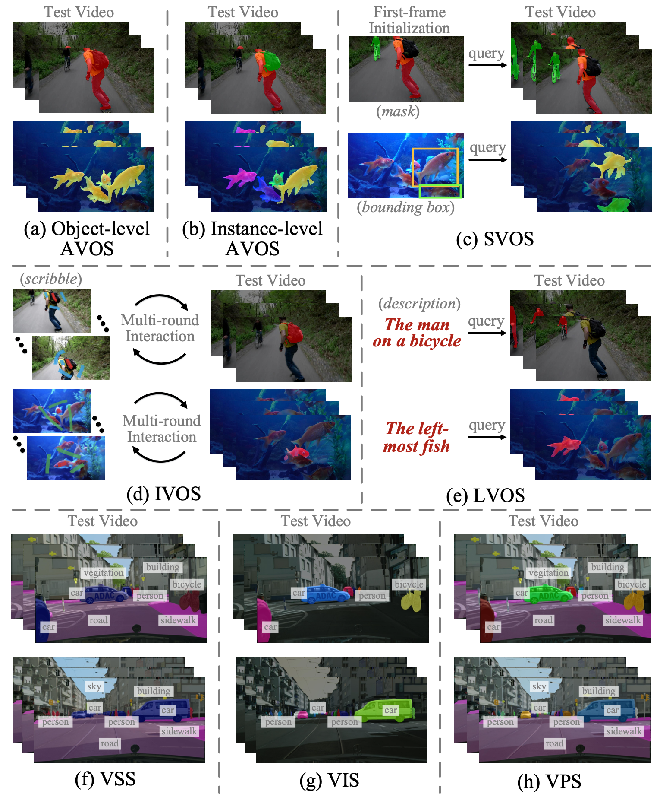

# A Survey on Deep Learning Technique for Video Segmentation

> [A Survey on Deep Learning Technique for Video Segmentation](https://arxiv.org/abs/2107.01153) <br>
> [Wenguan Wang](https://sites.google.com/view/wenguanwang), [Tianfei Zhou](https://www.tfzhou.com/), [Fatih Porikli](http://www.porikli.com/), [David Crandall](https://homes.luddy.indiana.edu/djcran/), and [Luc Van Gool](https://scholar.google.com/citations?user=TwMib_QAAAAJ). <br>
> [](https://arxiv.org/abs/2107.01153)

## 1. Introduction
Video segmentation, i.e., partitioning video frames into multiple segments or objects, plays a critical role in a broad range of practical applications, from enhancing visual effects in movie, to understanding scenes in autonomous driving, to virtual background creation in video conferencing. In this survey, we comprehensively review two basic lines of research — **video object segmentation** and **video semantic segmentation** — by introducing their respective task settings, background concepts, perceived need, development history, and main challenges. In particular, we review **eight** sub-fields as given in the following figure:




## 2. Deep Learning-based Video Object Segmentation

- [2.1 Automatic Video Object Segmentation (AVOS)]()
  - [2.1.1 Deep Learning Module based]()
  - [2.1.2 Pixel Instance Embedding based]()
  - [2.1.3  Short-term Information Encoding]()
  - [2.1.4  Long-term Context Encoding]()
  - [2.1.5  Un-/Weakly-supervised based]()
  - [2.1.6  Instance-level AVOS]()
- [2.2 Semi-automatic Video Object Segmentation (SVOS)]()
- [2.3 Interactive Video Object Segmentation (IVOS)]()
- [2.4 Language-guided Video Object Segmentation (LVOS)]()

## 3. Deep Learning-based Video Semantic Segmentation
- [3.1 (Instance-agnostic)VideoSemanticSegmentation(VSS)]()
  - [3.1.1 Sensory Anomaly Detection]()
  - [3.1.2 Semantic Anomaly Detection]()
- [3.2 Video Instance Segmentation (VIS)]()
- [3.3 Video Panoptic Segmentation (VPS)]()

## 4. Datasets


## Citation

If you find our survey and repository useful for your research, please consider citing our paper:
```bibtex
@article{wang2021survey,
  title={A survey on deep learning technique for video segmentation},
  author={Wang, Wenguan and Zhou, Tianfei and Porikli, Fatih and Crandall, David and Van Gool, Luc},
  journal={arXiv preprint arXiv:2107.01153},
  year={2021}
}
```
